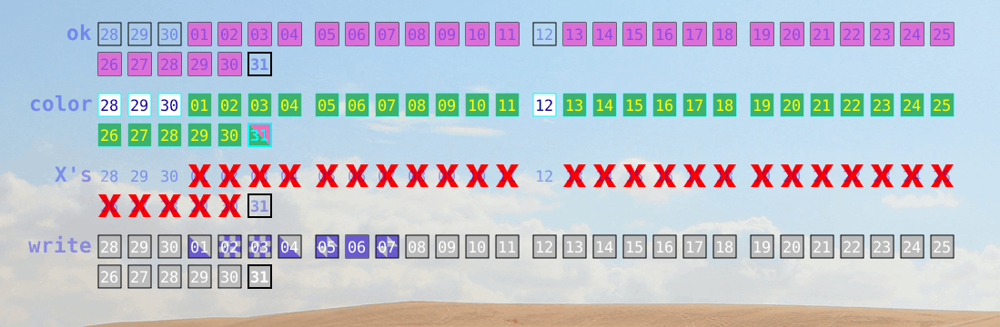

# Conky Ceaseless Chains — Never break the Chain




## Introduction

One proven strategy to be productive, improve yourself, stick to habits, and many other benefits, is the “Don’t break the chain” strategy, also known as the [Seinfeld Strategy](https://jamesclear.com/stop-procrastinating-seinfeld-strategy), although not made or used by him.

The idea is very simple. How to be a better stand-up comedian?

1. To be a better comedian is to create better jokes. And to create to better jokes you must write new jokes everyday.
2. Get a big wall calendar, put it on a prominent wall, and get a big red marker.
3. Everyday, once you do you writing task, put a big X on that day in the calendar.
4. Soon you’ll have a chain of X’s. **[Don’t break the chain!](https://nickwignall.com/seinfeld-strategy/)**

We can generalize point 1 as follows: identify a small, specific action, that if done everyday will eventually bring you to your goal.

Note that there is not a single word about results. Not a single word about deadlines. Just doing a small but meaningful *active* task, everyday, no excuses.

It doesn’t matter whether you write great jokes or not, as [quantity leads to quality](https://austinkleon.com/2020/12/10/quantity-leads-to-quality-the-origin-of-a-parable/), you will eventually be much better at what you’re doing.

And the rule isn’t to produce a lot, but to produce *consistently*. Do [something small, *every day*](https://austinkleon.com/2013/12/29/something-small-every-day/). As the old saying, “a consistent little is better than an intermittent lot”.

Because, think about it: Who would be a better writer: one who writes about 500 words everyday, or one who only writes 2,500 word articles, but writes them irregularly and intermittently?

“Rome wasn’t built in a day, but they were [laying bricks every hour](https://youtu.be/73gGYwlMrB8).”<sup>[[Invidious link](https://redirect.invidious.io/73gGYwlMrB8)]</sup>.

Don’t set deadlines for you goals; just [stick to a schedule](https://jamesclear.com/schedule-goals) or a system, and [your goals will take care of themselves](https://jamesclear.com/goals-systems).

Use a big calendar on a prominent wall and a big red marker to track your progress and remind you everyday. Or anything equally visible to you (like this project!). It must be visible to you, preferably all the time. [Habit tracking is essential](https://jamesclear.com/habit-tracker).

Newton’s first law of motion states that a body at rest remains at rest, and a body in motion at constant speed remains moving in a straight line, unless acted upon by a force.

Surprisingly this law applies to human actions, and is a key to maintain habits. Once you started doing some action, it’s generally easier to continue than to stop, and when you stop it may not be easy to start again.

When you start, **don’t break the chain!** That’s it. That’s the single rule. There is no deadlines or quality assurance. Just do it!

And when it happens someday that you broke that chain, because it will happen, **[just never fail twice in a row](https://www.riskology.co/forget-perfection/)**.

One isolated slip doesn’t affect the habit, according to [a study](https://onlinelibrary.wiley.com/doi/full/10.1002/ejsp.674). “What separates the elite performers from everyone else? Not perfection, but consistency.” “One mistake is just an outlier. Two mistakes is the beginning of a pattern.” [Never miss twice](https://jamesclear.com/second-mistake).

Note that your task need to be:

- So small and easy you can’t have excuses. [Start small](https://jamesclear.com/good-habits).
- Not too small, so it has a positive impact on you in the long run.
- [Active](https://jamesclear.com/taking-action). You need to do you want to do, not just reading, learning, or planning, but taking action.

> My favorite approach is to pick a very tiny version of your habit and track that. For example, I have been tracking the habit of “reading 1 page” for the last month. One reader named Günter did something similar. “I’ve done a simple workout every day for over half a year now. I managed to stick to it by changing the scope: when I don’t have time for a full set or don’t feel like it, instead of skipping altogether, I do an abbreviated session. I also mark it in my calendar.” ([One-sentence stories from people who have built better habits](https://jamesclear.com/one-sentence-habits).)

## Installation

1. Download this repo or clone it:
    - Click on the green “Code” button near the top of the page, and click “Download ZIP”, then extract it.
    - Or type `git clone https://github.com/noureddin/ccc` in a terminal.
2. Open the `ccc` directory you now have, and run `start.sh`.

## Usage

Edit the `ccc.lua` file in your preferred editor. If it’s already running, it will reload it automatically in three minutes (by default) once you save the file. You can force reloading it by running `start.sh` again.

The `ccc.lua` is a normal `.conkyrc` Lua file, but it also contains configuration for the CCC script, in addition to your chains. A few well-commented example files are in the `examples` directory of this repo. `ccc.0.lua` is a minimum starting point. `ccc.1.lua` is a more complete one.

The `ccc_chains` variable is a Lua table; every item in it is of this form:

```lua
    -- comments starts with two dashes till the end of line, and they are ignored
    { label = 'read', color = 'green', streak = {
        [20221208] = 1,
        [20221209] = 1,
        [20221210] = 1,
    }},  -- <- don't forget this comma
```

- `label` is a short (maybe mnemonic) name you give to every chain. You can leave it empty if you want to.
- `color` is the color of the filled squares, representing each day you have completed your task. Colors can be of various formats. To start, you can use any CSS named color (all lowercase, like `'mediumseagreen'`), and 3- or 6-digit hex HTML colors (like `'#abc'` or `'#1034A6'`), but all must be quoted.
- `streak` is the table of the your tasks. Days are represented in the format `[YYYYMMDD]`. It must be in this order, and surrounded by square brackets. Also months and days less that 10 need to be zero padded, like `[20230101]` for 2023, Jan, 1<sup>st</sup>.

Assigning `1` to a day marks it as complete, and fills its square with the color you specify. There are other modes to fill with. But because this mode (filling it completely) is the common case, it has a shorthand:

```lua
    { label = 'read', color = 'green', streak = {
        [20221208] = 3,  -- a chain of three days, 12-08 to 12-10
    }},
```

There are many other options, too.

### Fills

Some days you deserve or need rest, or are ill, or have real obligations out of your control. You sometimes miss a day, not because of procrastination or laziness. You shouldn’t work out if you’re ill, for example. The author of an article about Seinfeld Strategy (that I cannot find now) augmented the system with different marks or colors for when a day is missed because of a *strong* reason like illness, or because of a well deserved rest or vacation.

Also, you may have different levels for the same task, for example doing push-ups: 10+, or 25+, or 50+, or 100+. You may want to show that information on the calendar itself.

Because I have tied the color to the chain (i.e., the task itself), I tried to use some other way to indicate more information in the single cell (the square representing a day in the calendar), without literally putting text in it.

And that idea is using different fill patterns. Instead of assigning `1`  to a day, you can assign `'bottom_left_triangle'`, or any other fill. (Like colors, these names must be quoted.)


`reverse` is like “reverse video” in terminals, which is basically inverting the colors.

Note: don’t use two or more similar patterns in the same chain. That includes any pattern and its reverse, or both the left and right variants of a pattern.

You can assign fill patterns to shorter, more descriptive names, by providing another table called `fills`, for example:

```lua
    { label = 'write', color = 'slateblue', fills = {
        a = 'bottom_left_triangle',  -- 100--250
        b = 'reverse_checkered4',    -- 250--500
        c = 'right_most',            -- 500--1,000
                                     -- more is 1
    }, streaks = {
        [20221101] = 'a', -- 182
        [20221102] = 'b', -- 252
        [20221103] = 'b', -- 268
        [20221104] = 'a', -- 198
        [20221105] = 'c', -- 512
        [20221106] = 1,   -- 1,008  (notice: no quotes for numbers!)
        [20221107] = 'c', -- 721
    }},
```

The idea of “partial credit” came from CGP Grey's video *[This Journal Keeps Me Productive (& Maybe You Too)](https://youtu.be/fSwpe8r50_o)*<sup>[[Invidious link](https://redirect.invidious.io/fSwpe8r50_o)]</sup>.

However, I don’t recommend you approach it in the same exact way described in the video. Instead of choosing a task with a proper threshold, then choosing a “hilariously low” threshold, you should approach it from the other direction: determine what is the smallest task you can do and still see an improvement in the long run if you keep it. *Then* you add one or more “higher” levels.

You still can have tasks that is either “yes” or “no”, with no levels.

You also can have tasks with “higher-ups”, where the smallest task is small but not too small. For example: writing 100 words each day is the minimum, writing 500 words is better, and writing 1,000 is the best.

The idea is that there is not “partial credit”; what you do is just the task, not a partial task. This task is good on its own. But you can do a better task some days.

That said, you can follow any method that works for you. Or come up with your own.

### More chains options

- `inverse`: In a normal chain, a day is marked only when you assign `1` to it. If a chain has `inverse = true` (after `label` etc), then a day *not* assigned is considered full, and a day assigned `1` is an empty cell. (Other fill patterns are unaffected.) Use this for habits you want to break.
- `default_fill`: changes the default fill for every cell of a chain, from a full square. You still can assign different fills to different cells.
- `date_color`: changes the text color of the date on the cells of this chain. The default is translucent black.
- `background_color`: changes the background color of the cells of this chain. The default is none (i.e., full transparent).
- `border_color`: changes the border color of the cells of this chain. The default is translucent black.
- `border_thickness`: changes the border thickness of the cells of this chain.

(This section will be more expanded later.)

Most chains options (the primary exceptions are `label`, `color`, and `inverse`) can be set globally (outside `ccc_chains`), by prefixing it with `ccc_`. For example, having `ccc_background_color = 'white'` changes the background of the cells of all chains to white.

### Colors

These formats are understood:

- [CSS4 named colors](https://www.w3.org/TR/css-color-4/#named-colors). All lowercase. Quoted.
- [Tango colors](http://tango.freedesktop.org/Tango_Icon_Theme_Guidelines#Color_Palette). All lowercase. Quoted.
- HTML [hex-color](https://developer.mozilla.org/en-US/docs/Web/CSS/hex-color). All four syntax forms. Case-insensitive. Quoted.
- Decimal tuples: `{1, 0.5, 0.25}` for RGB, and `{1, 0.5, 0.25, 0.33}` for RGBA. All values are in the range 0 to 1. Must be *un*quoted.
- The color `'transparent'`, representing a fully transparent color.

## Credits

James Clear, Austin Kleon, and many others for spreading the knowledge on how to become better versions of ourselves.

Clock Rings by [londonali1010](https://www.gnome-look.org/member/132175/) (2009)<sup>(which I found in [Future Blue](https://www.gnome-look.org/p/1115388/))</sup>, which was my playground to learn Conky + Cairo + Lua.

[Miracle Conky](https://github.com/tflori/miracle-conky), where I learned tricks to make my Conky project stand-alone and easier to set up.

## The name

“Conky Chains” was an obvious starting name, but I wanted to make it more distinguishable.

I found an opportunity to choose an acronym consisting of a single letter repeated three times, and each time pronounced differently.

I chose “Ceaseless”, because it captures [two ideas](https://en.wiktionary.org/wiki/ceaseless): Consistency (unbroken chain) and Perseverance (unending chain).

## License

Apache License, Version 2.

Copyright 2021 Noureddin.
